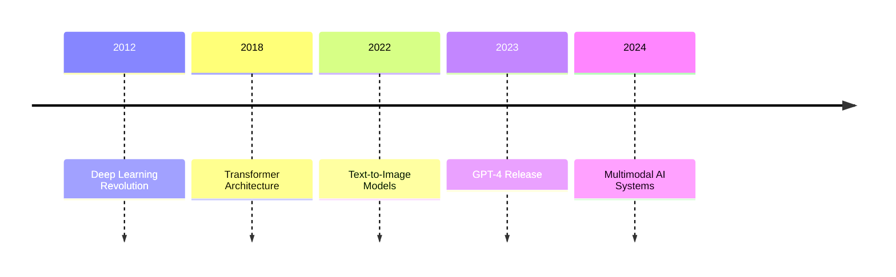
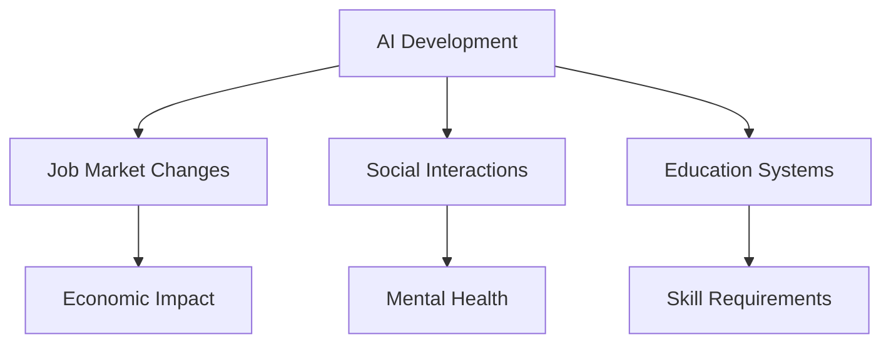
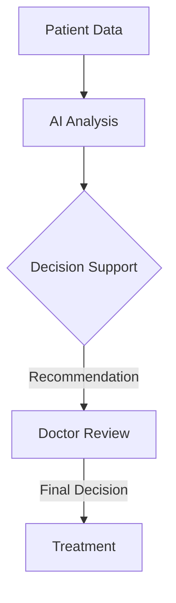

# The Ethics of AI: A Critical Examination

> "With great power comes great responsibility" has never been more relevant than in the age of artificial intelligence.

## Table of Contents

1. [Current State of AI](#current-state)
2. [Ethical Considerations](#ethical-considerations)
3. [Societal Impact](#societal-impact)
4. [Future Challenges](#future-challenges)
5. [Recommendations](#recommendations)

---

## Current State {#current-state}

The rapid advancement of AI technology has brought us to a crucial juncture:

- **Language Models**: GPT-4, Claude, Llama
- **Image Generation**: DALL-E, Midjourney, Stable Diffusion
- **Code Generation**: GitHub Copilot, Amazon CodeWhisperer
- **Autonomous Systems**: Self-driving cars, Robotics



## Ethical Considerations {#ethical-considerations}

### 1. Bias and Fairness

| Type of Bias | Description | Mitigation Strategies |
|--------------|-------------|----------------------|
| Data Bias | Training data reflects historical prejudices | Diverse datasets, bias testing |
| Algorithmic Bias | System design perpetuates unfairness | Regular audits, transparent design |
| Deployment Bias | Unequal access to AI benefits | Inclusive deployment policies |

### 2. Privacy Concerns

```ascii
    Data Collection
         ↓
    Data Processing
         ↓
    Model Training
         ↓
    Inference/Deployment
         ↓
    User Interaction
```

> ⚠️ **Key Privacy Challenges**:
> - Data ownership
> - Consent management
> - Right to be forgotten
> - Data minimization

### 3. Transparency

Levels of AI transparency:

```
Level 1: Black Box
└── Level 2: Partial Transparency
    └── Level 3: Explainable AI
        └── Level 4: Full Transparency
```

## Societal Impact {#societal-impact}

### Economic Effects

- [x] Automation of routine tasks
- [x] Creation of new job categories
- [ ] Economic inequality
- [ ] Workforce displacement

### Social Changes



### Cultural Implications

> 💭 **Questions to Consider**:
> 
> How will AI shape human creativity?
> What defines human intelligence in an AI world?
> Can AI understand cultural nuances?

## Future Challenges {#future-challenges}

### Short-term (1-5 years)

1. **Regulation Development**
   - Privacy laws
   - Liability frameworks
   - Safety standards

2. **Technical Challenges**
   ```python
   class AIChallenge:
       def __init__(self):
           self.challenges = {
               "explainability": "High",
               "reliability": "Medium",
               "safety": "Critical",
               "scalability": "Medium"
           }
   ```

### Long-term (5-20 years)

| Challenge | Probability | Impact | Urgency |
|-----------|------------|---------|---------|
| AGI Safety | High | Critical | High |
| Job Displacement | High | Severe | Medium |
| Digital Divide | Medium | High | High |
| Human Agency | High | Critical | High |

## Recommendations {#recommendations}

### For Policymakers

1. Develop comprehensive AI regulations
2. Invest in AI education
3. Create ethical frameworks
4. Establish oversight mechanisms

### For Developers

```typescript
interface EthicalAIGuidelines {
    transparency: boolean;
    fairness: boolean;
    accountability: boolean;
    privacy: boolean;
    safety: boolean;
}

class AISystem implements EthicalAIGuidelines {
    // Implementation must satisfy all ethical requirements
}
```

### For Society

- **Education**: Understanding AI capabilities and limitations
- **Participation**: Engaging in AI policy discussions
- **Adaptation**: Developing AI-complementary skills
- **Vigilance**: Monitoring AI impacts

## Case Studies

### Example 1: AI in Healthcare



### Example 2: AI in Justice System

| Aspect | Benefits | Risks |
|--------|----------|-------|
| Bias Reduction | Consistent decisions | Perpetuating historical bias |
| Efficiency | Faster processing | Loss of human judgment |
| Cost | Lower operational costs | Implementation expenses |

## Future Scenarios

Three possible futures:

1. **Optimistic Scenario**
   ```
   Human-AI Collaboration
   ├── Enhanced Capabilities
   ├── Solved Global Challenges
   └── Equitable Distribution
   ```

2. **Neutral Scenario**
   ```
   Mixed Integration
   ├── Some Displacement
   ├── New Opportunities
   └── Ongoing Adaptation
   ```

3. **Pessimistic Scenario**
   ```
   Technological Disruption
   ├── Mass Unemployment
   ├── Social Upheaval
   └── Loss of Human Agency
   ```

## Call to Action

> "The future of AI is not predetermined. It's up to us to shape it responsibly."

### What You Can Do

1. [ ] Stay informed about AI developments
2. [ ] Participate in ethical AI discussions
3. [ ] Support responsible AI initiatives
4. [ ] Advocate for ethical AI policies
5. [ ] Develop AI literacy

---

## Discussion Questions

1. How can we ensure AI benefits all of humanity?
2. What role should governments play in AI development?
3. How can we preserve human agency in an AI-driven world?

Share your thoughts and concerns about AI ethics in the comments below. Let's work together to create a future where AI serves humanity's best interests. 