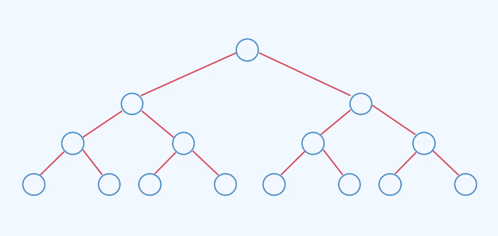

## From Binary Roots to Universal Branches: The Tree of All Things

> “The Tao produced One;  
> One produced Two;  
> Two produced Three;  
> And Three produced the ten thousand things.”  
> — *Tao Te Ching*, Chapter 42

This ancient reflection on emergence and multiplicity echoes deeply within the architecture of modern computation. From simple binary decisions arise sophisticated reasoning systems — like large language models (LLMs). In this post, we explore how the structure and logic of binary trees offer not just metaphorical insight, but practical heuristics for designing and training more efficient, more human-like models.

At its essence, a binary tree is a **hierarchy** — it begins with a root (*the One*), branches into Two, and recursively multiplies. This unfolding mirrors how complexity emerges from simplicity. The tree represents more than a data structure; it symbolizes the layered growth of meaning — in nature, in knowledge, in mind, and in machine.

## Exponential Growth in Binary Trees

One of the binary tree’s most remarkable properties is its **exponential expansion**. At each successive level:

- Level 0 (root): 1 node  
- Level 1: 2 nodes  
- Level 2: 4 nodes  
- Level 3: 8 nodes  
- Level *n*: 2ⁿ nodes

A modest increase in depth leads to a dramatic explosion in nodes. At depth 10, there are already 1,024 nodes; at depth 20, over a million.

Now imagine each node as a **unit of information** — a detail, a decision, a fragment of context. Without structure, the sheer volume quickly becomes unmanageable. And yet, human intelligence — and machine intelligence — must somehow operate within this ever-branching forest of information.

What rescues us from chaos is **abstraction**. The tree not only expands — it organizes. It transforms chaos into order through **layered representation**.

## Managing Complexity Through Abstraction

> “My life has limits, but knowledge has none.  
> To pursue the infinite with the finite is perilous.”  
> "吾生也有涯，而知也无涯。以有涯随无涯，殆已！"  
> — *Zhuangzi, Nourishing Life*

As the binary tree shows, the number of elements we might consider grows exponentially with depth. Trying to handle all details at once is not only inefficient — it is fundamentally impossible.

So how do we cope?

We **abstract**.

Too much abstraction, and we drift into vagueness:  
> *We speak truths that apply everywhere, but help nowhere.*

Too little abstraction, and we drown in minutiae:  
> **一叶障目，不见泰山**  
> *Blinded by a single leaf, one cannot see Mount Tai.*

True insight lies in balance —  
In seeing both the **forest and the trees**,  
In knowing when to zoom in, and when to rise above.

This is not just good philosophy — it’s good engineering. And it's essential to how both **human minds** and **LLMs** manage complexity.

## Human Brain vs. LLM: Who Abstracts Better?

Large language models are trained at the **lowest level of granularity** — predicting the next token, word by word, fragment by fragment. To succeed, they must memorize not just patterns, but exceptions, idioms, rare phrases, and statistical edge cases.

> The LLM’s mandate: **Don’t miss a word.**  
> The human brain’s instinct: **Don’t get lost in them.**

When we read, we rarely retain full sentences — not even the best ones.  
What remains is something more abstract: a **feeling**, a **scene**, a **core idea**.  
We remember **meaning**, not **surface**.

The eye may capture every pixel, but the mind filters — ignoring noise, smoothing edges, preserving essence.  
Humans **compress aggressively**. We generate specifics only when needed.

LLMs do the opposite.  
They **store detail indiscriminately** and try to extract generalization at the end.

This leads to a critical question:

> **Are LLMs operating at the wrong level of abstraction?**

Their training favors memorization, not insight.  
Inference tries to recover structure from statistics.  
But perhaps this is working backward.

Humans, by contrast, generalize as we read — and only imagine detail when prompted.

## The Binary Tree's Hidden Lesson: Abstraction = Efficiency

Here’s the profound lesson encoded in the binary tree:

> **With each rise in abstraction (depth), the number of elements to process is halved.**

This is not just elegant — it is efficient.

Higher levels of abstraction filter noise, expose structure, and allow sparse representations of dense realities.  
In knowledge terms: abstraction **amplifies signal** while **compressing data**.

Let’s apply this to LLM training.

- Today’s models are trained to predict the **next token** — a task as fine-grained as it gets.
- This requires memorizing vast amounts of trivial detail — punctuation, syntax, filler words.
- It’s compute-intensive, power-hungry, and often redundant.

## Train to Predict Meaning, Not Just Tokens

What if we trained differently?

Instead of predicting the next token,  
What if we trained models to **predict the summary** of the next paragraph?  
Or the **topic**, or **intent**, or **discourse function**?

Such a shift could:

- Reduce the number of training steps by **orders of magnitude**
- Encourage **top-down understanding**, not just bottom-up memorization
- Focus model capacity on **semantic abstraction**, not **syntactic mimicry**
- Enable **energy-efficient generalization**, more aligned with the human brain

The goal is not to simulate reading — but to emulate **comprehension**.

## Toward Models that Think Like Trees

We often assume progress lies in bigger models, longer contexts, or more tokens.  
But perhaps the key lies in training **at the right level of abstraction**.

The binary tree offers a timeless strategy:  
Grow upward. Organize complexity. Cut detail by half at every level.

LLMs today sprawl outward. But to reason better, they may need to grow **inward and upward** — toward structured, hierarchical, meaningful abstraction.

This is how trees manage growth.  
This is how humans manage thought.  
This is how LLMs could move beyond statistical prediction toward genuine understanding.

