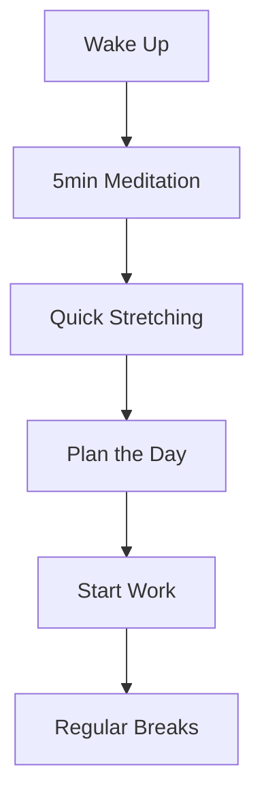

> "Health is not everything, but without health, everything is nothing."
> — Arthur Schopenhauer

As developers, we often get caught up in our work, forgetting to take care of our physical and mental well-being. Let's explore some essential health practices that every developer should consider.

# 🏃‍♂️ Physical Health Checklist

- [x] Set up an ergonomic workspace
- [ ] Exercise regularly
- [ ] Take frequent breaks
- [ ] Stay hydrated
- [ ] Maintain good posture

## 💺 Ergonomic Setup Essentials

| Item | Recommendation | Why It Matters |
|------|---------------|----------------|
| Chair | Adjustable height & lumbar support | Prevents back pain |
| Monitor | At arm's length, top at eye level | Reduces neck strain |
| Keyboard | Split or ergonomic design | Minimizes wrist strain |
| Mouse | Vertical or ergonomic design | Prevents carpal tunnel |

## 👀 Eye Care Tips

1. **20-20-20 Rule**
   * Every 20 minutes
   * Look at something 20 feet away
   * For at least 20 seconds

2. **Monitor Settings**
   * Adjust brightness to match environment
   * Use night mode when coding late
   * Consider blue light filtering glasses

***

## 🧘‍♂️ Mental Health Practices

### Daily Mindfulness Routine



### Stress Management Techniques

* Deep breathing exercises between coding sessions
* Regular walks outside
* Mindfulness meditation
* Social connections with colleagues
* Hobby time away from screens

## 💪 Exercise Routines for Developers

### Morning Routine (15 minutes)
1. Neck rotations (1 minute)
2. Shoulder rolls (1 minute)
3. Wrist stretches (1 minute)
4. Standing cat-cow stretches (2 minutes)
5. Desk push-ups (5 reps)
6. Squats (10 reps)
7. Jumping jacks (30 seconds)

### During Work
- Stand up every hour
- Walk during phone calls
- Desk stretches between tasks

### After Work
1. 30-minute walk or jog
2. Yoga or stretching
3. Strength training (optional)

## 🥗 Nutrition Tips

### Brain-Boosting Foods
* **Berries**: Improve memory and focus
* **Nuts**: Enhance cognitive function
* **Fish**: Omega-3 for brain health
* **Dark Chocolate**: Antioxidants for concentration
* **Green Tea**: Natural caffeine + L-theanine

### Meal Planning Template

```
Breakfast (7:30 AM)
└── Oatmeal + berries + nuts
    └── Green tea

Snack (10:30 AM)
└── Apple + almonds

Lunch (1:00 PM)
└── Protein + vegetables + whole grains
    └── Water

Snack (4:00 PM)
└── Greek yogurt + honey

Dinner (7:00 PM)
└── Salmon + quinoa + vegetables
    └── Herbal tea
```

## 🎯 Weekly Health Goals

1. [ ] Complete 3 workout sessions
2. [ ] Meditate for 10 minutes daily
3. [ ] Take all scheduled breaks
4. [ ] Drink 8 glasses of water daily
5. [ ] Get 7-8 hours of sleep nightly

## 📊 Track Your Progress

Keep a simple health journal:

```
Week of March 25, 2024
------------------------
Monday    [✓] Exercise [✓] Breaks [✓] Water [✓] Sleep
Tuesday   [✓] Exercise [✗] Breaks [✓] Water [✓] Sleep
Wednesday [✗] Exercise [✓] Breaks [✓] Water [✗] Sleep
Thursday  [✓] Exercise [✓] Breaks [✓] Water [✓] Sleep
Friday    [✓] Exercise [✓] Breaks [✓] Water [✓] Sleep
```

***

Remember: Your health is your most valuable asset. As developers, we need to invest in our well-being just as much as we invest in learning new technologies.

**What health practices have you found most helpful in your development career? Share your experiences in the comments below!** 