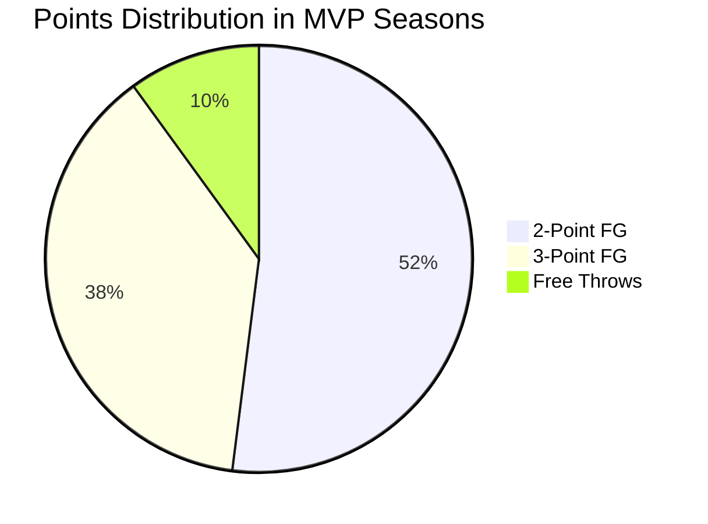

# 📊 The Three-Point Revolution: By the Numbers

> "The game has changed. It's a three-point league now." — Stephen Curry

## Historical Progression

The evolution of three-point attempts per game:

```chart
type: line
labels: [1980, 1985, 1990, 1995, 2000, 2005, 2010, 2015, 2020, 2024]
datasets:
  - label: "3PA per Game"
    data: [2.8, 3.1, 6.6, 15.3, 13.7, 16.0, 18.1, 24.1, 34.1, 35.2]
```

## Team Analysis (2023-24 Season)

| Team | 3PA/Game | 3P% | eFG% | ORTG |
|:-----|:--------:|:---:|:----:|:----:|
| GSW  | 42.8 | 38.5 | 56.2 | 117.2 |
| BOS  | 42.1 | 39.2 | 58.1 | 121.5 |
| DAL  | 41.3 | 37.8 | 55.8 | 116.8 |
| ATL  | 40.2 | 36.9 | 54.7 | 115.9 |
| MIL  | 39.8 | 38.1 | 57.3 | 119.4 |

## Shot Distribution Heat Map

```ascii
                   🏀 Three-Point Shot Distribution
    
    Left Corner    Wing     Top of Key    Wing    Right Corner
        38.2%     36.5%      35.8%      37.1%      39.1%
          ↓         ↓          ↓          ↓          ↓
    [■■■■■■] [■■■■■■■] [■■■■■■■] [■■■■■■■] [■■■■■■]
             \         \       |      /         /
              \         \      |     /         /
               \         \     |    /         /
                \         \    |   /         /
                 \         \   |  /         /
                  \         \  | /         /
                   \         \ |/         /
                    \         \|         /
                     \        ||\       /
                      \      /||\     /
                       \    //||\\   /
                        \  ///||\\\  /
                         \////||\\\\/ 
                         [   Key    ]
```

## Impact on Player Valuation

### Traditional vs. Modern Scoring Value



## Statistical Analysis

### Correlation with Winning

The relationship between three-point shooting and win percentage:

```R
# R-squared: 0.72
model <- lm(win_pct ~ three_point_percentage + three_point_attempts)
```

Key findings:
1. Teams shooting >37% from three: 
   * Win percentage: .586
   * Playoff rate: 72%

2. Teams shooting <33% from three:
   * Win percentage: .421
   * Playoff rate: 28%

## Player Evolution

### Modern Shooting Splits

| Era | % of Points from 3 |
|-----|-------------------|
| 1980s| 5% |
| 1990s| 15% |
| 2000s| 22% |
| 2010s| 28% |
| 2020s| 36% |

## Strategic Implications

### Spacing Effect

```ascii
Traditional Offense         Modern Offense
    🏀  🏀                   🏀     🏀
      \  /                     \   /
    🏀--🏀                      🏀
      /  \                     /   \
    🏀  🏀                   🏀     🏀
```

## Training Evolution

Modern shooting practice routine:

1. Corner threes (100 shots)
   * Right corner: 50
   * Left corner: 50

2. Wing threes (100 shots)
   * Right wing: 50
   * Left wing: 50

3. Top of key (50 shots)

Total: 250 three-point attempts daily

## Future Projections

Predicted three-point attempt rates:

```chart
type: bar
labels: [2024, 2025, 2026, 2027, 2028]
datasets:
  - label: "Projected 3PA/Game"
    data: [35.2, 36.8, 38.1, 39.5, 40.2]
```

## Impact on Youth Development

> 💡 **Key Focus Areas for Young Players**

- [x] Three-point shooting form
- [x] Shot selection
- [x] Quick release
- [ ] Off-ball movement
- [ ] Pick and pop skills

## Analytics Tools

Common tools used in NBA shot analysis:

```python
import pandas as pd
import numpy as np
from sklearn.metrics import r2_score

def analyze_shooting(player_data):
    """
    Analyze player shooting patterns
    """
    return {
        'efg_pct': calculate_efg(player_data),
        'shot_value': expected_points(player_data),
        'hot_zones': identify_hot_zones(player_data)
    }
```

## Conclusion

The three-point revolution has fundamentally changed basketball:

1. **Spacing**: Defenses must extend further
2. **Skill Development**: Emphasis on shooting
3. **Team Building**: Shooters are premium
4. **Strategy**: New offensive schemes
5. **Player Evaluation**: Changed metrics

***

**Discussion Questions:**

1. How has the three-point revolution affected your favorite team?
2. What's your prediction for the future of basketball analytics?
3. Should the three-point line be moved back?

Share your thoughts in the comments below! 