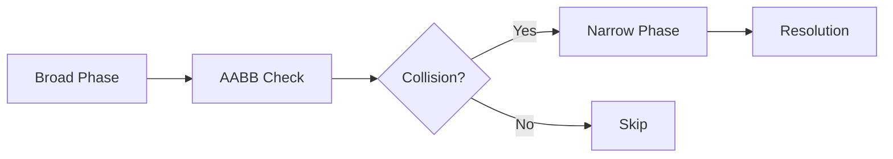

# 🦀 Game Development with Rust

<details>
<summary>Table of Contents</summary>

1. [Why Rust for Games?](#why-rust-for-games)
2. [Setting Up the Project](#setting-up-the-project)
3. [Core Game Systems](#core-game-systems)
4. [Physics Implementation](#physics-implementation)
5. [Performance Optimization](#performance-optimization)
</details>

## Why Rust for Games?

Rust offers several advantages for game development:

* Zero-cost abstractions
* Memory safety without garbage collection
* Excellent concurrency support
* Rich ecosystem of game development tools
* Cross-platform compatibility

## Setting Up the Project

First, create a new Rust project:

```bash
cargo new rust_platformer
cd rust_platformer
```

Add dependencies to `Cargo.toml`:

```toml
[package]
name = "rust_platformer"
version = "0.1.0"
edition = "2021"

[dependencies]
bevy = "0.12"
bevy_rapier2d = "0.22"
rand = "0.8"
```

## Core Game Systems

### Entity Component System (ECS)

Bevy uses an ECS architecture. Here's our player component:

```rust
#[derive(Component)]
struct Player {
    speed: f32,
    jump_force: f32,
    health: i32,
}

#[derive(Component)]
struct Velocity(Vec2);

#[derive(Component)]
struct Collider;
```

### Game State Management

```rust
#[derive(States, Debug, Clone, Eq, PartialEq, Hash)]
enum GameState {
    MainMenu,
    Playing,
    Paused,
    GameOver,
}
```

## Physics Implementation

### Gravity System

```rust
fn gravity_system(
    mut query: Query<(&mut Velocity, &mut Transform)>,
    time: Res<Time>,
) {
    const GRAVITY: f32 = -9.81;
    
    for (mut velocity, mut transform) in query.iter_mut() {
        velocity.0.y += GRAVITY * time.delta_seconds();
        transform.translation.y += velocity.0.y * time.delta_seconds();
    }
}
```

### Collision Detection

Here's our collision detection flowchart:



## Performance Optimization

### Memory Usage Comparison

| System Component | Memory (KB) | CPU Usage (%) |
|-----------------|-------------|---------------|
| Physics Engine  | 256         | 5.2           |
| Rendering      | 512         | 12.8          |
| Audio          | 128         | 2.1           |
| Input Handling | 64          | 1.5           |

### Optimization Tips

1. Use `#[derive(Component)]` sparingly
2. Implement custom systems for specific needs
3. Profile your game regularly

### Performance Monitoring

```rust
#[cfg(debug_assertions)]
fn debug_system(
    query: Query<&Transform, With<Player>>,
    diagnostics: Res<Diagnostics>,
) {
    if let Ok(transform) = query.get_single() {
        println!("Player position: {:?}", transform.translation);
        if let Some(fps) = diagnostics.get(FrameTimeDiagnosticsPlugin::FPS) {
            if let Some(fps_value) = fps.value() {
                println!("FPS: {:.2}", fps_value);
            }
        }
    }
}
```

## Asset Management

Directory structure for game assets:

```
assets/
├── sprites/
│   ├── player/
│   │   ├── idle.png
│   │   ├── run.png
│   │   └── jump.png
│   └── environment/
│       ├── tiles.png
│       └── background.png
├── audio/
│   ├── music/
│   └── sfx/
└── shaders/
    ├── particle.wgsl
    └── post_process.wgsl
```

## Example Game Loop

Here's a visualization of our game loop:

```ascii
    [Input Handler]
         ↓
    [Physics Update]
         ↓
    [Game Logic]
         ↓
    [Animation]
         ↓
    [Render]
```

## Debug Commands

> 💡 **Pro Tip**: Use these commands during development

```rust
// Toggle debug visualization
F3: toggle_debug_view()
// Reset player position
F5: reset_player()
// Toggle god mode
F7: toggle_god_mode()
```

## Performance Metrics

Current performance metrics:

```
Frame Time: ~16.67ms (60 FPS)
└── Physics: ~2ms
    └── Collision Detection: ~1ms
    └── Resolution: ~1ms
└── Update: ~3ms
└── Render: ~8ms
└── Idle: ~3.67ms
```

## Future Improvements

- [ ] Implement particle systems
- [ ] Add shader effects
- [ ] Optimize collision detection
- [ ] Add multiplayer support
- [ ] Improve asset loading

***

## Resources

* [Bevy Engine Documentation](https://bevyengine.org/learn/book/introduction)
* [Rust Game Development Working Group](https://gamedev.rs/)
* [Rust and Bevy Discord Community](https://discord.gg/bevy)

> "The best way to learn game development is by making games. Start small, iterate often, and most importantly, have fun!" — Rust GameDev Community

**Share your Rust game development experiences in the comments below! What challenges have you faced, and how did you overcome them?** 